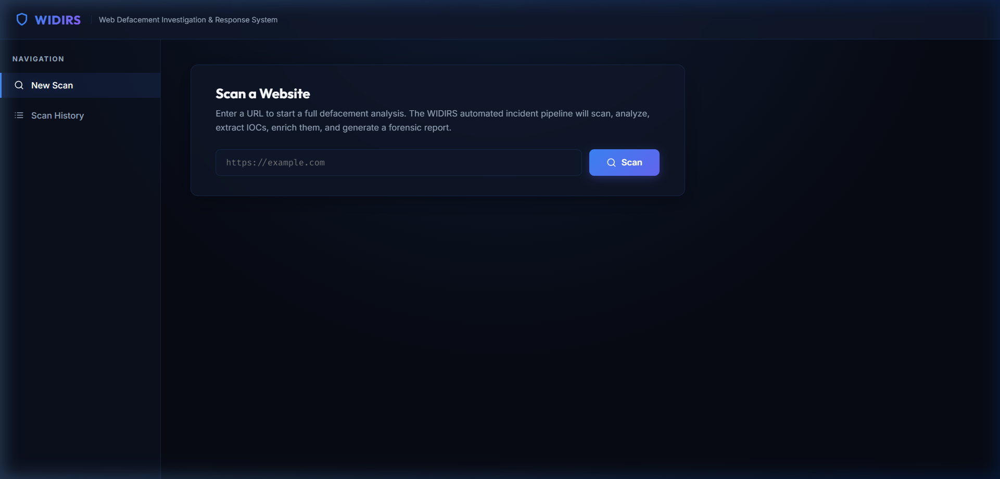
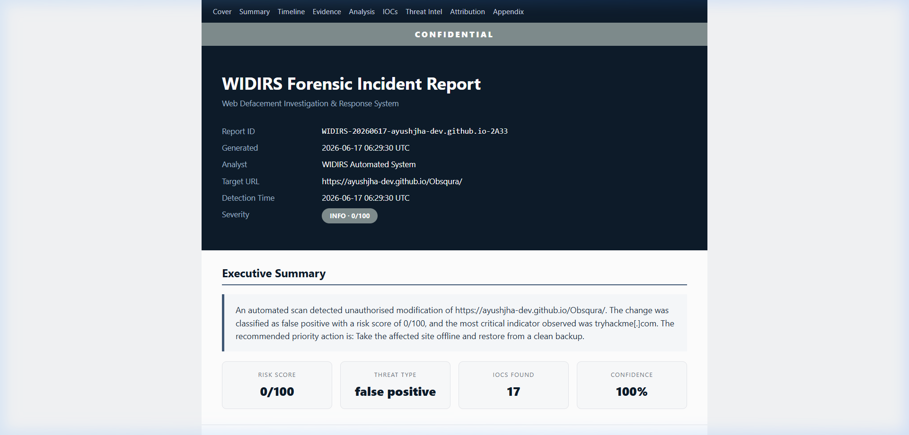
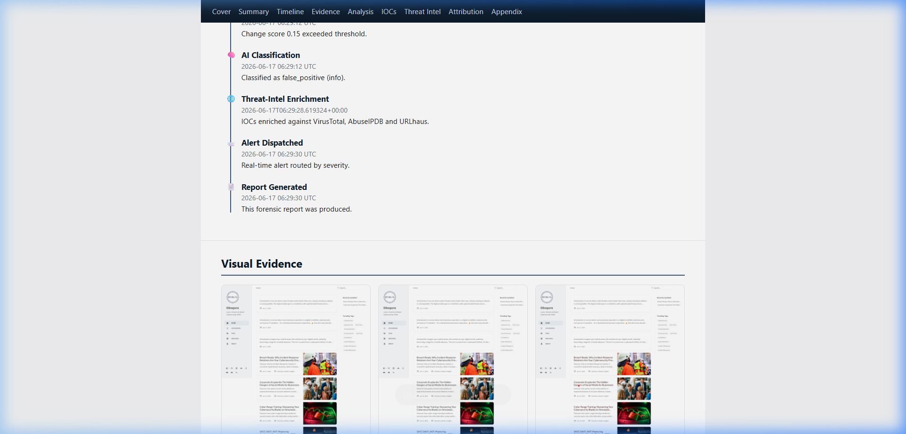
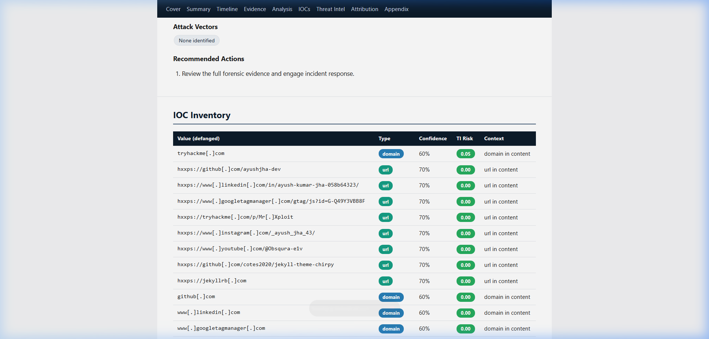

# <p align="center">🛡️ WIDIRS</p>
# <p align="center"><em>Web Defacement Investigation & Response System</em></p>

<p align="center">
  
  
  
  
  
</p>

---

## 🌌 The Philosophy

In the vast digital landscape, truth is written in code and captured in snapshots. Yet adversaries seek to alter this truth—to rewrite the narrative of our web presence. **WIDIRS** stands as a sentinel at the boundaries of this reality, vigilantly observing the sacred integrity of your digital presence.

Born from the conviction that *awareness precedes defense*, WIDIRS operates on a fundamental principle: **to know is to protect, and to understand is to prevail**. It embodies the ancient wisdom of pattern recognition—comparing what *is* against what *should be*, and when discord is found, it illuminates the path to truth through forensic analysis and intelligent attribution.

---

## 💡 What We Guard

**WIDIRS** is an enterprise-grade sentinel of digital integrity—an autonomous guardian that perpetually monitors your web presence for unauthorized alterations. Through the convergence of machine vision and artificial intelligence, it orchestrates a symphony of detection, analysis, and response:

- **🔍 Continuous Vigilance**: Captures the essence of your web presence—both visual and structural—against an ever-shifting tapestry of threats
- **🧠 Cognitive Analysis**: Leverages **Google Gemini AI** to perceive the intent behind each mutation, classifying threats with human-like understanding
- **🔗 Evidence Gathering**: Autonomously extracts traces of intrusion—digital breadcrumbs left by threat actors
- **🌍 Contextual Enrichment**: Cross-references findings with global threat intelligence networks (**VirusTotal**, **AbuseIPDB**, **URLhaus**) to place incidents within the broader landscape of cyber warfare
- **⚡ Immediate Response**: Orchestrates real-time alerts through **Telegram** and **Email**, ensuring no threat goes unheeded
- **📋 Forensic Documentation**: Produces immutable, chain-of-custody verified reports—chronicles of compromise for investigation and accountability

---

## 👥 The Architects

Every great system is born from the collaboration of minds united by purpose. **Team Task 3 Q1** is a fellowship of engineers, each contributing their unique perspective to this shared vision:

| Visionary | Specialization | Essence |
| :---: | :---: | :--- |
| **Ayush Kumar Jha** | *Security Philosophy & AI Intelligence* | Architected the soul of WIDIRS—the end-to-end incident response pipeline. Wove together Google Gemini's cognitive capabilities to perceive threat patterns and attribute adversaries with unprecedented clarity. |
| **Niranjan Singh** | *Foundation & Memory* | Engineered the backbone—async SQLite persistence, intelligent caching, and the structured knowledge base that allows WIDIRS to learn and remember. |
| **Parkash Kumar Yadav** | *Interface & Experience* | Crafted the window into WIDIRS's mind—a dashboard that speaks in glassmorphic elegance, rendering real-time streams of insight and historical narratives. |
| **Harman Singh** | *Orchestration & Dispatch* | Built the neural pathways—Telegram communion, email conduits, and throttled alert intelligence that ensures humanity receives each warning with perfect timing. |

---

## 🗺️ The Evolution—Three Phases of Ascension

Like the great epics of philosophy and literature, WIDIRS's journey unfolds in three transformative phases, each deeper in capability, each more profound in impact. We move from *observation* → to *intervention* → to *prevision*.

### 🟢 Phase 1: *Awakening* — Detection & Understanding *(Current)*

*"First, we must see. Then, we must comprehend."*

The foundation phase awakens WIDIRS to the presence of compromise:

- **👁️ Perception**: Playwright orchestrates clean, unbiased captures of web presence—rotating identity, obscuring tracking, ensuring the truth seen is uncontaminated
- **🔎 Discernment**: Dual engines of comparison—visual perception (pHash, SSIM) and structural analysis (DOM inspection)—converge to detect even subtle mutations
- **🧠 Cognition**: Google Gemini AI interprets intent, classifying modifications through 9 security taxonomies and illuminating threat-group motivations
- **📊 Intelligence**: Real-time enrichment from global threat networks, cached wisely to avoid redundant queries
- **💬 Communication**: Instantaneous alerts through Telegram and Email—human-centered notification crafted for comprehension and action
- **📜 Chronicling**: Cryptographically signed forensic reports—chain-of-custody verified evidence for investigation and accountability

### 🟡 Phase 2: *Intervention* — Active Healing & Distributed Defense *(Upcoming)*

*"Then, we must respond. And we must do so with precision."*

The mitigation phase empowers WIDIRS to act, not merely to observe:

- **🔄 Self-Restoration**: Automated remediation through backup restoration or git configuration, healing compromised content instantaneously
- **🛡️ Dynamic Protection**: Real-time WAF rule deployment to Cloudflare, AWS WAF, ModSecurity—creating walls of defense
- **🌐 Distributed Sentinels**: Agents across global nodes, bypassing geo-targeting and localized attack vectors
- **🤝 Enterprise Integration**: STIX/TAXII export, seamless fusion with corporate SIEMs and SOAR orchestration platforms

### 🔴 Phase 3: *Prescience* — Autonomous Hunting & Predictive Defense *(Future)*

*"Finally, we must anticipate. We must become the predator before the hunter strikes."*

The apex phase grants WIDIRS the power of foresight and autonomy:

- **🕸️ Honeypot Ecosystems**: Dynamic Docker sandboxes that mirror the target, capturing live payload behavior and exploitation patterns
- **🔍 Vulnerability Prophecy**: Autonomous penetration scanning (SQLi, XSS, path traversal, CVE matching) triggered upon compromise detection
- **🔮 Predictive Barriers**: Secondary AI agents that absorb threat-actor chatter, deploying defensive rules *before* campaigns launch
- **⚙️ Custom Playbooks**: Analysts author bespoke remediation workflows, each site category with its own orchestrated destiny

---

## 📸 The Interface — Windows Into Clarity

### 🎨 The Dashboard — A Portal of Insight
Our web interface transcends mere functionality, embodying the principles of modern design philosophy—glassmorphic elegance, luminous typography, and an interface that speaks the language of intuition. Real-time streams flow across the screen, each scan rendered as a choreography of progress and discovery.



### 📋 The Forensic Report — Chronicles of Compromise
Each incident generates a narrative written in the language of evidence. Our reports echo the precision of CrowdStrike's finest work—confidence gauges, risk assessments, temporal timelines, visual diffs rendered side-by-side, and unified code trees. A document worthy of both analyst and executive, designed to illuminate and convince.





---

## ✨ The Capabilities — Where Art Meets Science

*Behold the instruments of WIDIRS, each a blade honed to perfect precision:*

- **👁️ Unbiased Perception**: Playwright orchestrates captures through rotated identities, obscuring trackers—ensuring the digital snapshot reflects truth uncontaminated by third-party observation

- **🔬 Bifurcated Analysis**: A union of sensory and cognitive comparison—perceptual hashing (pHash), structural similarity indices (SSIM), pixel-perfect diffs married with DOM schema inspection, each lens revealing what others miss

- **🧬 Semantic Classification**: Google Gemini's neural understanding categorizes each mutation into 9 security paradigms (*phishing overlay*, *SEO defilement*, *hacktivist voice*), each tagged with risk elevation and threat probability

- **🔍 Forensic Archaeology**: Algorithmic excavation of compromise traces—IPv4 signatures, domain registrations, cryptographic hashes, email conduits, attacker identities, and blockchain wallets unearthed through specialized pattern recognition

- **🌍 Global Context**: Concurrent consultation with the world's threat intelligence commons—VirusTotal, AbuseIPDB, URLhaus—with intelligent caching to honor rate limits and accelerate insight

- **🧩 Hybrid Attribution**: Signature-based genealogy merged with Gemini's cognitive pattern-matching, together forming a tapestry that links incidents to known adversary collectives with unprecedented confidence

- **⚡ Adaptive Notifications**: Intelligent alert orchestration—critical threats dispatched instantly via Telegram with interactive keyboards, while minor anomalies coalesce into hourly summaries, respecting human attention and cognition

- **🔗 Immutable Evidence**: Cryptographically signed forensic briefs with SHA-256 chain-of-custody verification, rendering each report a veritable chronicle suitable for legal examination and executive presentation

---

## 🏗️ The Architecture — The Anatomy of Intelligence

*The system operates as an orchestrated symphony, each module a distinct voice:*

```
User / Web Dashboard (The Eye)
      │
      ▼
dashboard.py  ──────────────────────────────────►  Flask HTTP Server
      │                                             (The Gateway)
      │  POST /api/scan
      ▼
main.py  run_full_incident_pipeline()              (The Conductor)
      │
      ├──► modules/monitor.py        Step 1: Witness & Perceive (Playwright capture)
      ├──► modules/change_detect.py  Step 2: Discern Deviation (Visual + DOM diffing)
      │                              Step 3: Threshold & Filter
      ├──► modules/ai_classify.py    Step 4: Interpret Intent (Gemini classification)
      ├──► modules/ioc_extract.py    Step 5: Excavate Evidence (IOC parsing)
      ├──► modules/threat_intel.py   Step 6: Contextualize (VT / AbuseIPDB / URLhaus)
      ├──► modules/attribution.py    Step 7: Identify Perpetrators (Signature + AI)
      ├──► database.py               Step 8: Crystallize Knowledge (SQLite persistence)
      ├──► modules/alerts.py         Step 9: Communicate Danger (Telegram + Email)
      └──► modules/report_gen.py     Step 10: Chronicle Evidence (Jinja2 forensics)
```

### 📂 The Knowledge Base — Directory of Purpose

```
widirs/
├── main.py              # The Orchestrator
├── dashboard.py         # The Interface (Server-Sent Events enabled)
├── config.py            # The Constitution (Pydantic settings)
├── database.py          # The Memory (Async SQLite)
├── models.py            # The Ontology (Data structures)
├── pyrightconfig.json   # IDE Navigation
├── requirements.txt     # Dependencies
├── .env                 # Secrets & Configuration
├── data/
│   ├── db/widirs.db     # The Persistent Mind
│   ├── snapshots/       # Captured Moments (baseline & incident)
│   ├── diffs/           # Visual Mutations (bounding box overlays)
│   ├── reports/         # Forensic Chronicles (HTML & PDF)
│   └── signatures.yaml  # Threat Actor Genealogy
├── modules/
│   ├── monitor.py       # The Perceptor (Playwright + aiohttp)
│   ├── change_detect.py # The Comparator (Visual & structural analysis)
│   ├── ai_classify.py   # The Interpreter (Gemini)
│   ├── ioc_extract.py   # The Archaeologist (Pattern extraction)
│   ├── threat_intel.py  # The Researcher (Global intelligence)
│   ├── attribution.py   # The Detective (Hybrid matching)
│   ├── alerts.py        # The Messenger (Dispatch & throttle)
│   └── report_gen.py    # The Chronicler (Jinja templating)
└── templates/
    └── report.html.j2   # The Testimony (Forensic template)
```

---

## 🛠️ Inception — Installation & Awakening

*Before WIDIRS can serve as your digital sentinel, it must be awakened. Here are the sacred steps of initiation:*

### Prerequisites
- **Python 3.11 or newer** — the language of logic
- **Virtual Environment** — isolation and purity
- **Modern web browser** — to commune with the dashboard

### The Ritual of Setup

1. **Navigate to the sanctuary** (project directory):
   ```bash
   cd WIRIDS
   ```

2. **Create your sacred `.env` scroll** from the template:
   ```bash
   copy .env.example .env
   ```
   *Then open `.env` and inscribe your API keys—Google Gemini, VirusTotal, Telegram credentials—the keys to global consciousness.*

3. **Summon your virtual realm**:
   ```bash
   # Windows
   .venv\Scripts\activate.ps1
   
   # Linux / macOS
   source .venv/bin/activate
   ```

4. **Inscribe the dependencies into your environment**:
   ```bash
   pip install -r requirements.txt
   ```

5. **Grant access to the browser mechanism**:
   ```bash
   playwright install chromium
   ```

---

## 🚀 Deployment — Awakening WIDIRS to Action

*The system awaits your command. Choose your path:*

### 🖥️ The Web Interface — Dialogue with the Dashboard *(Recommended)*
Invoke the Flask oracle and open the gateway to understanding:

```bash
python dashboard.py
```

Visit **http://localhost:5000** in your browser—a glassmorphic portal awaits, ready to receive your scan requests, display real-time intelligence, and archive past discoveries.

### ⌨️ The Command Line — Direct Invocation

**First Encounter — Establish Baseline:**
```bash
python main.py scan --url https://example.com --baseline
```
*WIDIRS captures its first glimpse of your web presence, creating a reference against which all future mutations will be measured.*

**Subsequent Scans — Hunt for Deviation:**
```bash
python main.py scan --url https://example.com
```
*Compares the live site against your baseline. Detects changes, classifies threats, enriches with intelligence, and dispatches immediate alerts.*

**Continuous Vigilance — Daemon Monitoring:**
```bash
python main.py monitor --config sites.yaml
```
*WIDIRS enters meditative watchfulness, scanning across the URLs in your manifest at their prescribed intervals.*

**Channel Testing — Verify Communication:**
```bash
python main.py test --channel telegram
python main.py test --channel email
```
*Confirms that Telegram and Email conduits are operational, allowing you to receive WIDIRS's warnings.*

---

## ⚙️ The Configuration Grimoire — Customization Variables (`.env`)

*Each setting tunes WIDIRS to your specific needs:*

| Variable | Default Value | Meaning |
|---|---|---|
| `GOOGLE_API_KEY` | — | **Required.** The key to Google Gemini's cognitive realm. |
| `VIRUSTOTAL_API_KEY` | — | Access to VirusTotal's comprehensive threat encyclopedia. |
| `ABUSEIPDB_API_KEY` | — | Gateway to AbuseIPDB's IP reputation intelligence. |
| `TELEGRAM_BOT_TOKEN` | — | The channel through which WIDIRS speaks to Telegram. |
| `TELEGRAM_CHAT_IDS` | — | The recipients of WIDIRS's warnings (comma-separated). |
| `SMTP_HOST` / `SMTP_PORT` | — | The postal service for email notifications. |
| `SNAPSHOT_DIR` | `data/snapshots` | Where captured moments are stored for posterity. |
| `REPORT_DIR` | `data/reports` | The archive of forensic chronicles. |
| `MIN_CHANGE_SCORE` | `0.10` | The sensitivity threshold—how significant must a change be to trigger awareness? |

---

## 🧪 The Test of Truth — Validating Your Installation

*Before deploying WIDIRS to production, ensure its mechanisms are sound:*

```bash
.venv\Scripts\python -m pytest
```

*The comprehensive test suite validates all modules, ensuring detection accuracy, attribution precision, and alert reliability.*

**Current Status:** ✅ **73/73 tests passing** — The system is proven.

---

## 🎯 The Mission

In an age of digital warfare, truth is the first casualty. Compromised websites blur the line between what is and what appears to be. WIDIRS stands at this threshold, an unwavering sentinel that honors the principle: *in a world of deception, visibility is power*.

By automating the detection, analysis, and attribution of web defacement, we enable organizations to respond not with panic, but with clarity. Each alert carries intelligence. Each report documents evidence. Each investigation brings us closer to understanding the adversary's intent.

This is the work of WIDIRS—to see what others miss, to understand what others overlook, and to ensure that no compromise goes unnoticed.

---

*Developed with precision and philosophy by Team Task 3 Q1*
*A creation of digital vigilance, born in June 2026*
